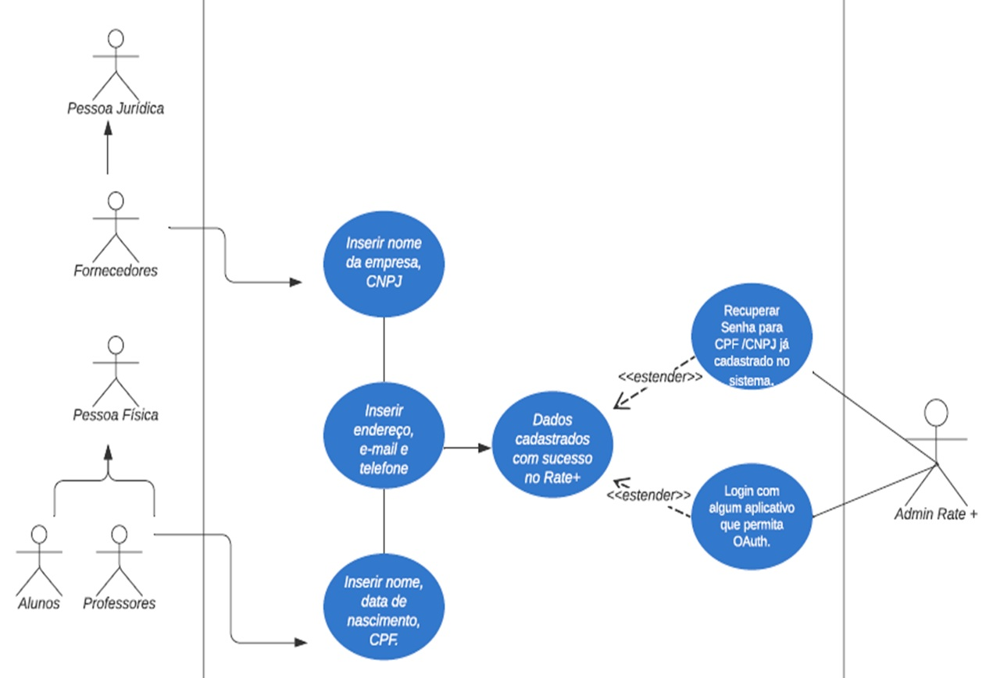

# Proposta de Sistema Orientado a Objetos – Segunda Entrega 

# Sistema Rate+

# Introdução:

Este trabalho apresenta a modelagem de um sistema orientado a objetos para a gestão de dados de uma universidade, utilizando a Linguagem Unificada de Modelagem (UML). O sistema, chamado Rate+, visa centralizar e gerenciar informações de cadastro sobre pessoas físicas e jurídicas, incluindo professores, alunos e fornecedores. O trabalho inclui o diagrama de casos de uso, com descrição detalhada dos cenários para cada caso, é um diagrama de classes, que representa a estrutura do sistema e suas relações entre as classes. 

# Tecnologias Utilizadas:

Front-end:

HTML: Estruturação do conteúdo web.

CSS: Estilização visual do site.

Vue.js: Framework JavaScript para criar interfaces interativas.

Back-end:

JavaScript: Adicionar interatividade, pode ser utilizado no back-end para gerenciar dados e se comunicar com servidores.

Node.js: Plataforma JavaScript para desenvolvimento de aplicações web.

Banco de Dados:

SQL Server: Armazenamento de dados, incluindo informações dos usuários.

Editor de Código:

VS Code: Ferramenta de desenvolvimento com extensões para facilitar o trabalho.

# Funcionalidades:

Cadastro de novos usuários.

Login e autenticação de usuários.

[Descreva outras funcionalidades aqui]

# Protótipo:

[Insira imagens do protótipo aqui]

# Como Executar:

[Instruções para configurar o ambiente de desenvolvimento]

[Instruções para iniciar o servidor back-end]

[Instruções para iniciar o servidor front-end]

# Diagramas UML:

)

# Contribuições:

Contribuições são bem-vindas! Por favor, siga as diretrizes de contribuição [link para diretrizes].

# Licença:

LICENÇA DE USO DO SOFTWARE RATE+ 
